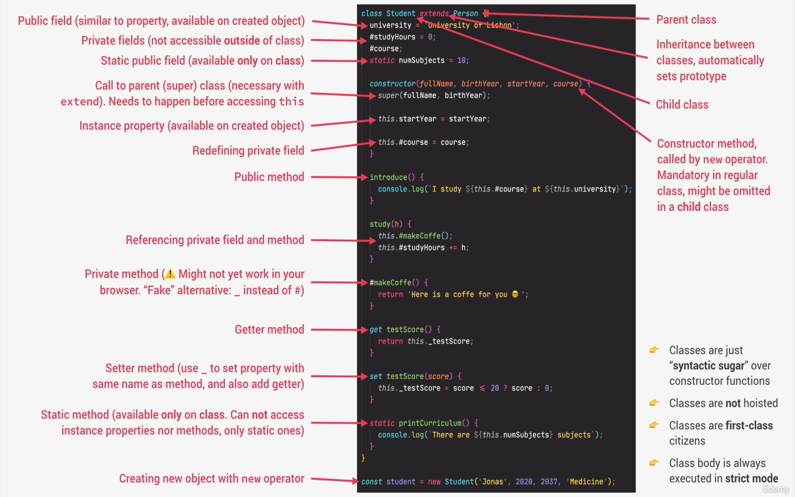

## Notes for the OOP with JS section

In this section OOP concepts were introduced and applied in JS.

- Object-Oriented Programming

  - Programming paradigm based on objects
  - Objects
    - Pack together data (properties) and corresponding behaviour (methods)
    - Building blocks of an application that interact with each other
    - Interact through public interface (API)
    - Organize code and are more flexible
  - Classes
    - Blueprint for new similar objects
  - Instances
    - Real objects usable in code created from a class
  - 4 Fundamental Principles
    - Abstraction - hiding away details that don’t matter for our problem (black box)
    - Encapsulation - keeping some properties and methods private inside the class
      - (prevents external code to manipulate with internal properties and methods)
      - Allows to change internal implementation without breaking external code
    - Inheritance - One class (parent) extends a simmilar class (child)
      - Parent class makes all it’s properties and methods available to the child class
      - Modeling real-world relationships
    - Polymorphism - Child class can overwrite a method inherited from parent class
  - OOP in JS
    - Prototype - all objects are linked (delegate behaviour) to a prototype
      - contains methods accesible from the object
    - Constructor functions - creating objects programatically using a function
    - ES6 Classes - abstraction over constructor functions
    - `Object.create()` - easiest way of linking an object to a prototype
  - Constructor functions - regular function called with the `new` operator
  - `new` operator (4 steps to create an object)
    1. New empty object
    2. The function is called, this keyword is the new object
    3. The object is linked to a prototype (`__proto__` property)
    4. The object is automatically returned
  - `<variable> instanceof <constructor function>` - return true if the variable is an instance of the constructor function
  - Prototype
      <aside>
      ➡️ Object property of every function that is **inherited** by **all objects created by this function**
      
      </aside>
      
      - Every object created through a constructor function will inherit all properties and methods declared on the prototype property
      - Each function in JS has a property called prototype (including constructors) - `Person.prototype`
      - Used to declare methods for OOP objects
      
      ```jsx
      // Function called by the new operator
      function Person(firstName, birthYear) {
        this.firstName = firstName;
        this.birthYear = birthYear;
      }
      
      // Properties and methods on the prototype object
      Person.prototype.calcAge = function () {
        console.log(2037 - this.birthYear);
      };
      ```

  - Prototype chain
    - Series of links between objects linked through prototypes (all objects inherit from `Object.prototype`)
  - ES6 Classes

    - Still implement Constructor functions but with a nicer more readable syntax
    - Classes are executed in strict mode
      <aside>
      ❗ Classes are NOT hoisted

      </aside>

      ```jsx
      class PersonCl {
        // Function called by the new operator
        // constructer has to be named like this
        constructor(firstName, birthYear) {
          this.firstName = firstName;
          this.birthYear = birthYear;
        }

        // Properties and methods on the prototype object
        calcAge() {
          console.log(2037 - this.birthYear);
        }
      }
      ```

  - Getters and Setters

    - Every object can have a getter and a setter property (accessor properties)
    - Used for data validation (when getters and setters are used with the same name as a property)
    - Getter does not have arguments
    - Setter has exactly one argument

    ```jsx
    const account = {
      owner: 'filip',
      movements: [200, 530, 120, 300],

      get latest() {
        return this.movements.slice(-1).pop();
      },

      set latest(mov) {
        this.movements.push(mov);
      },
    };

    // Calling a getter (used WITHOUT parentheses)
    account.latest; // Output: 300

    // Calling a setter
    account.latest = 100;
    console.log(account.movements); // Output: [..., 300, 100]
    ```

  - Static methods
    - Neither static methods nor static properties can be called on instances of the class. Instead, they're called on the class itself.
    - Often utility functions, such as functions to create or clone objects, whereas static properties are useful for caches, fixed-configuration
  - Object.create (not really used)

    - Creates a new object and manually
    - No constructor functions or `new` keyword
    - Manually setting prototype of an object to another object
    - Used for inheritance between classes

    ```jsx
    const PersonProto = {
      calcAge() {
        console.log(2037 - this.birthYear);
      },

      // Not a constructor
      init(firstName, birthYear) {
        this.firstName = firstName;
        this.birthYear = birthYear;
      },
    };

    // Manually setting properties
    const sarah = Object.create(PersonProto);
    sarah.init('Sarah', 1979);
    ```

  - Inheritance between classes
    - Parent class
    - Child class - subtype of the parent class
      - Can use methods and properties of the parent
    - Constructor functions
      - We must link it’s prototypes together: `Student.prototype = Object.create(Person.prototype);`
      - We must call the parent function in the child class with `.call()`, beacause otherwise the `this` keyword is set to `undefined`: `Person.call(this, *firstName*, *birthYear*);`
    - ES6 Classes
      - Using the `extends` keyword and the `super` function (always first)
      - Otherwise exactly the same as constructor functions
      ```jsx
      class Student extends Person {
        constructor(fullName, birthYear, course) {
          super(fullName, birthYear); // calling the constructor
          // func of the parent
          this.course = course;
        }
      }
      ```
  - Polymorphism
    - Classes even if they are related can have the same method with different functionlity. Which method is used depends on the context
  - Encapsulation (Data Privacy)

    - To keep some properties and methods accessible only in the given class
    - The other properties and methods are exposed to the user as the API
    - Reasons:
      - Prevent code from outside to change code inside the classes
      - Easier to maintain and scale the “inside” of the class
    - Convention: marking “protected” properties and methods with an undescore ”\_”

      ```jsx
      this._pin = pin;

      _approveLoan() {
          return true;
        }
      ```

    - Class fields: new feature enabling the usage of real private methods and properties

      - Written before the constructor function in a class

      ```jsx
      class Account {
        // Must be separated by a COMA ";" symbol
        // Public field
        locale = navigator.language;

        // Must be separated by a COMA ";" symbol
        // Private fields (with a HASH "#" symbol)
        #movements = [];
        #pin;

        constructor(pin, owner) {
          this.owner = owner;
          this.#pin = pin;
        }

        // Public methods
        deposit(value) {
          this.#movements.push(value);
        }

        // Currently unsupported
        // Private methods
        #approveLoan() {
          return true;
        }
      }
      ```

  - Chaining methods

    - The method must be called on the specified object therefore we must return `this` (the object itself) in the chained method

    ```jsx
    // ...
    deposit(value) {
        this.#movements.push(value);

        return this; // For chaining
      }

      withdraw(value) {
        this.deposit(-value);

        return this; // For chaining
      }

    // ...
    acc1.deposit(300).deposit(500).withdraw(35);
    ```

  - ES6 Classes Summary
    
